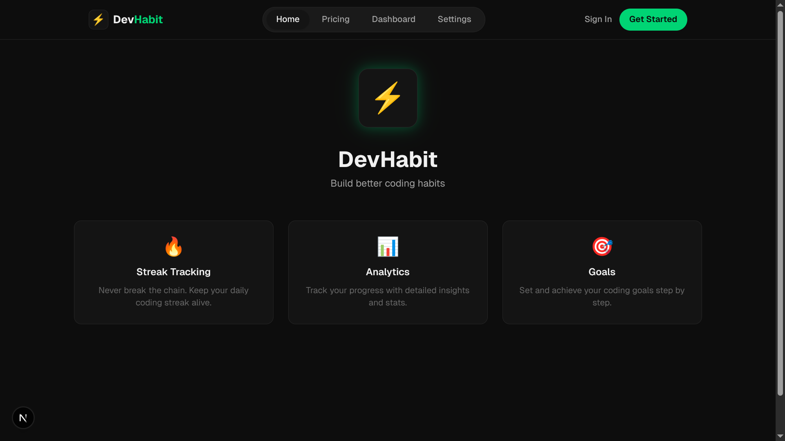

# DevHabit

<p align="center">
  
</p>

A modern web application to help developers build and maintain better coding habits through streak tracking, analytics, and goal setting.

## Features

- **Streak Tracking** - Never break the chain. Keep your daily coding streak alive with visual heatmaps.
- **Analytics** - Track your progress with detailed insights and stats.
- **Goals** - Set and achieve your coding goals step by step.

## Tech Stack

- **Framework:** Next.js 16
- **Language:** TypeScript
- **Styling:** Tailwind CSS v4
- **Runtime:** React 19
- **Package Manager:** Bun

## Getting Started

### Prerequisites

- Bun installed on your machine

### Installation

1. Clone the repository:
```bash
git clone https://github.com/yourusername/devhabit.git
cd devhabit
```

2. Install dependencies:
```bash
bun install
```

3. Run the development server:
```bash
bun dev
```

4. Open [http://localhost:3000](http://localhost:3000) in your browser.

## Scripts

- `bun dev` - Start the development server
- `bun build` - Build the production application
- `bun start` - Start the production server
- `bun lint` - Run ESLint

## Project Structure

```
devhabit/
├── app/                 # Next.js app directory
│   ├── components/      # Reusable components
│   │   └── layout/      # Layout components (Navbar, MainLayout)
│   ├── dashboard/       # Dashboard page
│   ├── pricing/         # Pricing page
│   ├── settings/        # Settings page
│   ├── layout.tsx       # Root layout
│   └── page.tsx         # Home page
├── public/              # Static assets
│   └── preview.png      # App preview image
├── package.json         # Dependencies and scripts
└── next.config.ts       # Next.js configuration
```

## Contributing

Contributions are welcome! Please feel free to submit a Pull Request.

## License

This project is licensed under the [MIT License](LICENSE).
